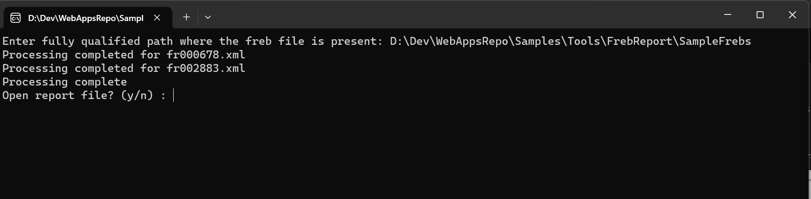
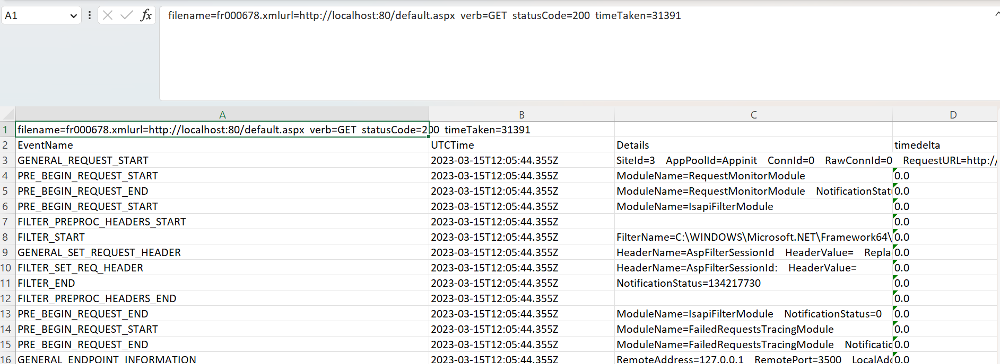

# Freb Analyzer

[Failed Request Tracing](https://learn.microsoft.com/en-us/iis/troubleshoot/using-failed-request-tracing/using-failed-request-tracing-rules-to-troubleshoot-application-request-routing-arr)
is a great way to troubleshoot IIS slowness/return codes. The trace files can be opened used Edge/IE and using the [FrebViewer](https://github.com/sujeetsharma/FrebViewer). However, when the FREB file is huge (>20 mb), the tools would not be able to open them. This tool creates a summary of events from freb files which can be used for large freb files specially in case of classic ASP.

## Features
* Generates a excel report with all the events in the trace with time taken by the event
* Designed to read multiple files in a folder, creates multiple sheets in report for each trace.

> Download Windows - [frebprocessing.exe](./dist/httpload.exe)

## Running

* Using the Windows package - [frebprocessing.exe](./dist/frebprocessing.exe)
    * Double click on frebprocessing.exe

* Running via python
    * Install dependant packages
    * Install python and open a terminal

            cd <path to project folder>

            python frebprocessing.py

## Compiling (requires python and VC runtime)

* Install pyinstaller 
    
            pip install pyinstaller

* package (check pyinstaller documentation for more details on commands and requirements)
  
            pyinstaller --onefile -i .\resources\logo.ico .\frebprocessing.py

