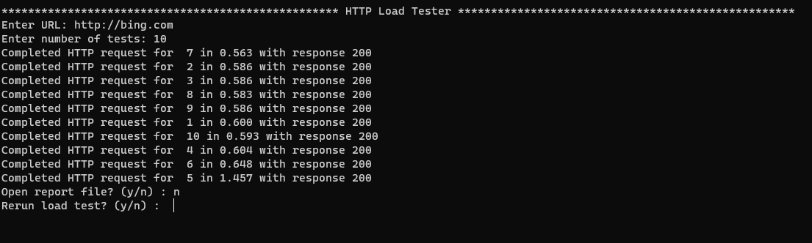
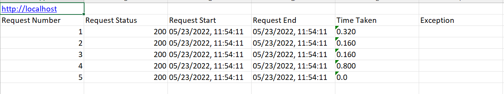

# Http Load Tester 

Use this to reproduce Web Application issues or simply load test your web server. Inspired by [Tinyget](https://www.tessferrandez.com/blog/2008/02/04/debugging-demos-setup-instructions.html#:~:text=Tinyget%20used%20to%20be%20a%20part%20of%20the%20IISToolkit%2C%20as%20this%20is%20no%20longer%20available%2C%20I%20have%20created%20a%20PS%20script%20and%20added%20it%20to%20my%20DebuggingScripts%20Repository)

## Features

* Uses async-io, concurrent requests will be hitting the URL
* Report - Generates a excel report with request details

> Download Windows - [httpload.exe](./dist/httpload.exe)

## Running

* Using the Windows package - [httpload.exe](./dist/httpload.exe)
    * Double click on httpload.exe

* Running via python
    * Install python and open a terminal

            cd <path to project folder>

            python httpload.py

## Compiling (requires python and VC runtime)

* Install pyinstaller 
    
            pip install pyinstaller

* package (check pyinstaller documentation for more details on commands and requirements)
  
            pyinstaller --onefile -i .\resources\logo.ico .\httpload.py

